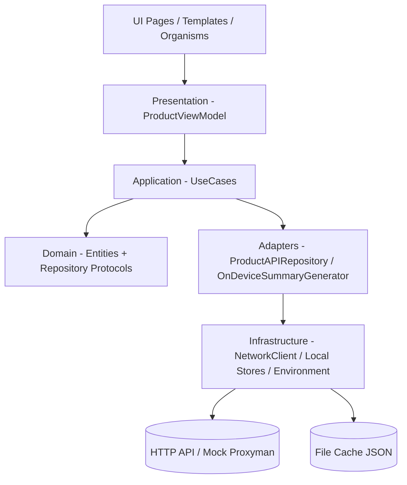

# Documento tecnico de arquitectura

## 1) Arquitectura elegida y justificacion

### Arquitectura base: Hexagonal (Ports and Adapters)

Se adopto una arquitectura hexagonal para separar responsabilidades, hacer el codigo más testeables y mantener el acoplamiento bajo.

- **Domain** define entidades y contratos (puertos), sin depender de red, UI ni storage.
- **Application** implementa casos de uso que orquestan el dominio.
- **Adapters / Infrastructure** resuelven detalles tecnicos concretos (HTTP, cache local, generacion de resumen on-device).
- **Presentation** usa `ProductViewModel` para exponer estado de pantalla.

### Arquitectura UI: Atomic Design

Se eligio esta arquitectura debido a que esto mejora reutilizacion de componentes, evita duplicacion y hace mas claro el limite entre layout y logica de estado.

La capa visual se organiza en:
```bash 
UI/
 ├── Atoms/
 ├── Molecules/
 ├── Organisms/
 ├── Templates/
 └── Views/
```
---

## 2) Diagrama de capas / modulos



## 3) Modelos de datos

### 3.1 Entidades de dominio

#### `Product`

- `id: Int`
- `title: String`
- `image: String`
- `reviews: [Review]`
- `summary: ReviewSummary?`
- derivados:
  - `reviewCount`
  - `averageRating`

#### `Review`

- `author: String`
- `rating: Int`
- `text: String`

#### `ReviewSummary`

- `sentiment: Sentiment`
- `strengths: [String]`
- `weaknesses: [String]`
- `summary: String`

#### `Sentiment`

- `.positive`
- `.neutral`
- `.negative`

### 3.2 DTOs de red

En `ProductAPIRepository`:

- `ProductDTO`
- `ReviewDTO`

Responsabilidad: decodificar JSON de API y mapear a `Product` / `Review`.

### 3.3 Modelos de UI (estado de presentacion)

En `ProductViewModel`:

- `products: [Product]`
- `isLoading: Bool`
- `error: String?`
- `summaries: [Int: ReviewSummary]` (key = `productId`)
- `loadingSummaryIds: Set<Int>`
- `summaryErrors: [Int: String]`

---

## 4) Estrategia de AI on-device

### Framework y enfoque

El resumen de reseñas se implementa en `OnDeviceSummaryGenerator`:

1. **Camino principal**: `FoundationModels` (`SystemLanguageModel`) cuando esta disponible.
2. **Camino secundario fallback local**: metodo heuristico basado en keywords y tokens cuando el modelo no esta disponible o falla.

### Armado del prompt

Para `FoundationModels`:

- se toman hasta 20 reseñas;
- se normaliza texto y se limita el tamano (`reviewTextBlock`);
- se construyen instrucciones del rol (analista e-commerce, salida en espanol, sin inventar hechos);
- se pide salida estructurada via `@Generable` (`GuidedReviewSummary`).

### Compatibilidad y fallback

Si algo no cumple o la generacion falla:

- se usa `makeHeuristicSummary(...)`;
- la app sigue funcional, sin dependencia cloud.

---

## 5) Estrategia de persistencia local
Se almacena en caché en archivos .json, esta decisión se toma para mantener el app ligera 

### Productos

- Componente: `FileProductLocalStore`
- Archivo: `products-cache.json`
- Ubicacion: `cachesDirectory`
- Uso:
  - se guarda al recibir productos de red;
  - se lee al iniciar `load()` para mostrar cache rapido.

### Resumenes de reseñas

- Componente: `FileSummaryRepository`
- Archivo: `review-summaries.json`
- Ubicacion: `cachesDirectory`
- Estructura: diccionario `[String(productId): ReviewSummary]`
- Uso:
  - `GenerateReviewSummaryUseCase` devuelve cache si existe;
  - si no existe, genera y guarda;
  - `RegenerateReviewSummaryUseCase` sobrescribe el valor.


## 6) Estrategia de testing

### Objetivo

Validar comportamiento de dominio, casos de uso, repositorios y flujo de presentacion sin depender de red real.

### Estrategia aplicada

- Uso de dobles (stubs/spies/mocks) para `NetworkClient`, `ProductLocalStore`, `SummaryRepository`, `ReviewSummaryGenerator`.
- Pruebas de flujo:
  - guardado y lectura de resumen;
  - manejo de loading/error en `ProductViewModel`;
  - persistencia local de productos en repositorio.
- Prueba de performance para generacion de resumen en lote.

